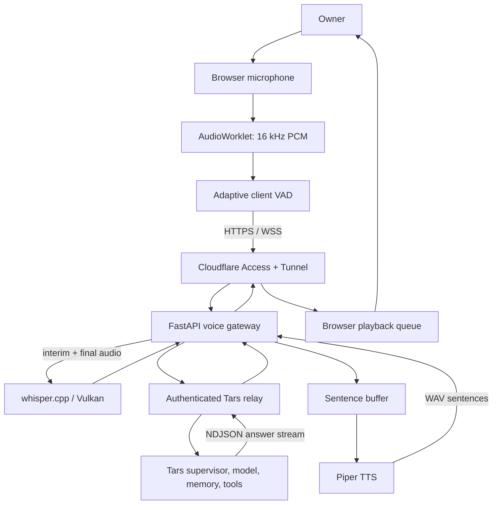

# Tars Voice

A private, voice-first progressive web app for holding continuous conversations with a local [Tars](https://github.com/agustinsacco/tars) assistant.

Tars Voice combines automatic turn detection, local Whisper speech recognition, streamed Tars responses, and local Piper speech synthesis behind Cloudflare Access. After one browser gesture, it listens continuously, detects utterance boundaries, shows interim captions, speaks responses, and supports local playback interruption.

## Highlights

- Continuous hands-free conversation after one initial browser gesture
- Adaptive browser VAD with server-side WebRTC VAD confirmation
- Local `whisper.cpp` `large-v3-turbo` transcription with interim captions
- Incremental NDJSON relay into Tars
- Sentence-level Piper synthesis for low first-audio latency
- Cloudflare Access JWT verification at the application boundary
- Loopback-only gateway, relay, and speech services
- Bounded metadata-only diagnostics and readiness checks
- Installable, dependency-free PWA interface

## Architecture



See [`docs/architecture.md`](docs/architecture.md) for trust boundaries, turn behavior, and detailed component responsibilities.

## Repository layout

```text
gateway/          FastAPI gateway, Access verification, STT/TTS adapters
static/           Installable PWA and AudioWorklet
tests/            Unit and gateway contract tests
deploy/systemd/   Hardened user-service templates
docs/             Architecture, protocol, setup, operations, and diagnostics
scripts/          Repeatable local validation
```

## Quick validation

Requirements: Python 3.12+, Node.js 20+, and Bash.

```bash
make setup
make validate
```

The test suite mocks model loading and does not require Whisper or Piper model files.

## Production prerequisites

- A Linux host with systemd user services
- A built `whisper.cpp` server; Vulkan is recommended
- A Whisper GGML model
- A Piper ONNX voice and its JSON metadata
- A loopback Tars relay implementing the documented NDJSON contract
- A Cloudflare Tunnel and Access application

Start with [`docs/setup.md`](docs/setup.md), then review [`docs/configuration.md`](docs/configuration.md) and [`docs/runbook.md`](docs/runbook.md).

## Security model

The browser never receives relay credentials. Cloudflare Access authenticates the user, and the gateway independently validates the Access JWT signature, issuer, audience, expiry, subject, and configured email identity. All backend listeners remain on loopback.

See [`SECURITY.md`](SECURITY.md) and [`docs/security.md`](docs/security.md).

## Limitations

- Barge-in stops local playback but does not authoritatively cancel an in-flight Tars or tool operation.
- Only one active browser connection and one queued follow-up are supported.
- Interim captions use repeated bounded Whisper snapshots rather than a token-streaming STT engine.
- Model time-to-first-token is typically the dominant conversational latency.

## License

MIT — see [`LICENSE`](LICENSE).
