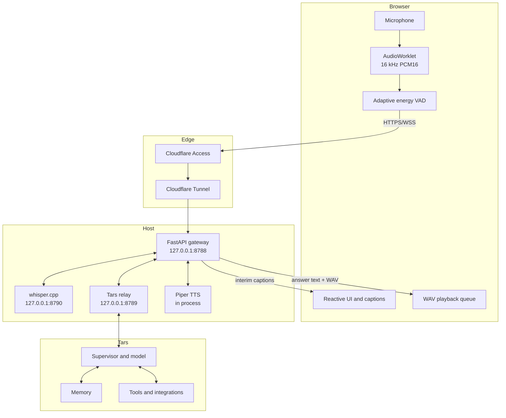
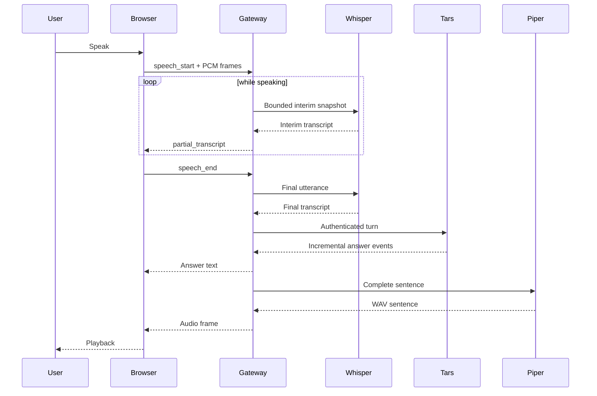

# Architecture

## Purpose

Tars Voice is a private speech interface for Tars. It adds browser audio capture, automatic turn detection, speech recognition, speech synthesis, and a narrow transport adapter. Tars remains authoritative for reasoning, durable memory, tools, confirmations, and action policy.

## Topology

## Component responsibilities

### Browser PWA

- Requests microphone access after a user gesture.
- Uses an `AudioWorklet` to downsample input to 16 kHz mono signed PCM16.
- Maintains an adaptive noise floor and detects speech onset/end.
- Streams bounded binary PCM frames over an authenticated WebSocket.
- Displays interim/final captions and streamed answer text.
- Queues sentence-level WAV audio and stops it immediately on local barge-in.

### Cloudflare Access and Tunnel

- Access authenticates the configured user identity.
- Tunnel carries HTTPS and WebSocket traffic to the loopback gateway.
- The gateway does not trust tunnel placement alone; it validates the signed Access assertion.

### Voice gateway

- Verifies Host, exact Origin, Access JWT signature, issuer, audience, expiry, subject, and email.
- Allows one active WebSocket and one queued follow-up.
- Buffers only the current utterance, capped by `VOICE_MAX_AUDIO_SECONDS`.
- Runs server-side WebRTC VAD before authoritative transcription.
- Schedules bounded interim Whisper snapshots while speech continues.
- Sends final text through the authenticated Tars relay.
- Sentence-buffers incremental answers and synthesizes each sentence with Piper.
- Emits bounded metadata-only diagnostics.

### whisper.cpp

- Runs as a persistent local inference server.
- Produces interim snapshots and an authoritative final transcript.
- Requests are serialized by the gateway so interim work does not contend with final transcription.

### Tars relay

- Authenticates the gateway bearer token.
- Submits recognized text through the normal Tars channel path.
- Streams typed NDJSON events back to the gateway.
- Preserves Tars memory, tool, and confirmation semantics.

### Piper

- Loads once during gateway startup.
- Synthesizes complete sentences to WAV in process.
- Keeps first-audio generation independent of complete-answer generation.

## Turn lifecycle

## Concurrency and interruption

Only one browser WebSocket is active at a time. Only one Tars turn runs per connection; at most one recognized follow-up is queued.

Barge-in immediately stops browser playback and increments the gateway generation so stale TTS is suppressed. The current relay has no authoritative cancellation endpoint, so an in-flight Tars or tool operation may continue. The UI must not claim otherwise.

## Data lifecycle

The browser and gateway process audio ephemerally. The gateway does not write recordings or transcripts. Whisper may use a private runtime directory for format conversion. Diagnostics retain only timing, byte counts, character counts, event categories, and short random correlation identifiers.

## Reference performance

A validated Vulkan deployment observed:

- First interim caption: approximately 0.7 seconds after speech onset
- Final Whisper transcription: approximately 0.24–0.29 seconds
- Piper sentence generation: approximately 0.03–0.12 seconds

Tars model time-to-first-answer was the dominant latency and varied substantially by turn.
